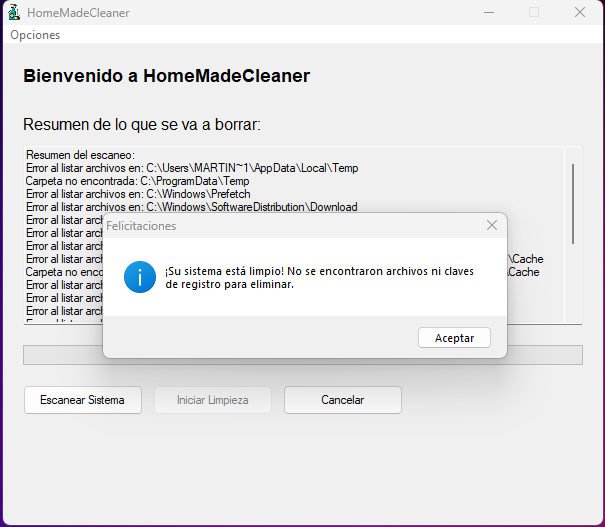

# HomeMadeCleaner

HomeMadeCleaner es un script sencillo de PowerShell para limpiar archivos temporales y basura en tu PC. Este "limpia PC hecho en casa" es ideal para quienes desean liberar espacio y mejorar el rendimiento del sistema sin depender de aplicaciones de terceros. Aunque es básico, hace el trabajo de manera eficiente.

## Características

- **Limpia archivos temporales** de las carpetas comunes de Windows.
- **Elimina caché y archivos basura** de navegadores populares:
  - Google Chrome
  - Microsoft Edge
  - Mozilla Firefox
  - Opera
  - Brave
  - Vivaldi
- **Borra datos de la Papelera de reciclaje**.
- **Solicita permisos de administrador automáticamente** si es necesario.
- **Resumen antes de la limpieza**: Muestra un resumen de los archivos y carpetas que se eliminarán, junto con el espacio que se recuperará.
- **Confirmación del usuario**: Pide confirmación antes de proceder con la limpieza.
- **Espacio recuperado**: Calcula y muestra el espacio total recuperado después de la limpieza.

## Novedades en la Versión 1.01

- **Interfaz gráfica mejorada**: Ahora el script cuenta con una interfaz gráfica más intuitiva y fácil de usar.
- **Barra de progreso**: Se ha añadido una barra de progreso para mostrar el avance de la limpieza.
- **Botón de cancelación**: Los usuarios pueden cancelar el proceso de limpieza en cualquier momento.
- **Mensaje de sistema limpio**: Si no se encuentran archivos ni claves de registro para eliminar, se muestra un mensaje de felicitaciones.
- **Créditos actualizados**: La ventana de créditos ahora incluye la versión del programa y un diseño más limpio.

## Requisitos

Para **ejecutar** el programa:
- **Windows 10 o superior**.
- **No se requiere PowerShell** (el programa es un ejecutable compilado con AutoIt).

Para **compilar** el código fuente:
- **AutoIt v3** (disponible en [autoitscript.com](https://www.autoitscript.com)).

## Instalación

1. Descarga el archivo ejecutable `HomeMadeCleaner.exe` desde este repositorio.
2. Colócalo en una carpeta de tu elección.

## Uso

1. Haz doble clic sobre el archivo `HomeMadeCleaner.exe` para ejecutarlo.
2. Si se te solicita, otorga permisos de administrador.
3. El programa mostrará una interfaz gráfica con las opciones de escaneo y limpieza.
4. Haz clic en **Escanear Sistema** para ver un resumen de los archivos y carpetas que se eliminarán.
5. Si deseas proceder con la limpieza, haz clic en **Iniciar Limpieza**.
6. El programa comenzará a limpiar las carpetas predefinidas y te informará sobre los archivos eliminados.

## Carpetas limpiadas

El programa limpia las siguientes ubicaciones:

### Windows
- `C:\Windows\Temp`
- `C:\Windows\Prefetch`
- `C:\Windows\SoftwareDistribution\Download`
- `C:\Windows\Logs`
- Papelera de reciclaje: `C:\$Recycle.Bin`

### Usuario
- `C:\Users\[NombreDeUsuario]\AppData\Local\Temp`
- `C:\Users\[NombreDeUsuario]\AppData\LocalLow\Temp`
- `C:\Users\[NombreDeUsuario]\AppData\Roaming\Microsoft\Windows\Recent`
- `C:\Users\[NombreDeUsuario]\Downloads` (opcional)

### Navegadores
- **Google Chrome**: Caché y archivos temporales.
- **Microsoft Edge**: Caché y archivos temporales.
- **Mozilla Firefox**: Caché y offline cache.
- **Opera, Brave, Vivaldi**: Caché y archivos temporales.

## ¿Qué no hace?

Este programa **no limpia el registro de Windows**. Aunque podría implementarse, la limpieza del registro puede ser riesgosa si no se realiza correctamente. Se recomienda usar herramientas específicas para ello, como CCleaner o similares, y proceder con precaución.

## Precauciones

- **Archivos importantes**: Asegúrate de no tener archivos necesarios en las carpetas que se van a limpiar, como `Downloads`.
- **Navegadores**: Este programa puede cerrar sesiones abiertas o eliminar descargas parciales.
- **Ejecución segura**: Si tienes dudas, revisa el código antes de ejecutarlo.

## Contribuciones

HomeMadeCleaner es un proyecto abierto. Si deseas agregar nuevas funcionalidades, como la limpieza del registro o la automatización de tareas, no dudes en hacer un **fork** y enviar tus mejoras mediante un **pull request**.

## Licencia

Este proyecto está bajo la licencia MIT. Consulta el archivo `LICENSE` para más información.

---

## Captura de Pantalla



---

## Ejemplo de Resumen

Antes de la limpieza, el programa mostrará un resumen como este:

```
Resumen de lo que se va a borrar:
----------------------------------

Archivos y carpetas a eliminar:
- C:\Windows\Temp (8 archivos/carpetas, 0 GB)
- C:\Users\Martin Oviedo\AppData\Local\Temp (44 archivos/carpetas, 0.05 GB)
- C:\Windows\Prefetch (24 archivos/carpetas, 0 GB)
- C:\Windows\SoftwareDistribution\Download (4977 archivos/carpetas, 0.01 GB)
- C:\Windows\Logs (240 archivos/carpetas, 0 GB)
- C:\Users\Martin Oviedo\AppData\Roaming\Microsoft\Windows\Recent (5 archivos/carpetas, 0 GB)
- C:\Users\Martin Oviedo\AppData\Local\Microsoft\Windows\Explorer (15 archivos/carpetas, 0 GB)
- C:\Users\Martin Oviedo\AppData\Local\Microsoft\Edge\User Data\Default\Code Cache (232 archivos/carpetas, 0.01 GB)

Claves del registro a eliminar:
- HKCU:\Software\Classes\Local Settings\Software\Microsoft\Windows\Shell\BagMRU (14 claves)
- HKCU:\Software\Classes\Local Settings\Software\Microsoft\Windows\Shell\Bags (179 claves)

Espacio total a recuperar: 0.07 GB

¿Está seguro de que desea continuar? (S/N)
```

---

¡Gracias por usar HomeMadeCleaner! Si tienes sugerencias o comentarios, no dudes en abrir un **issue**.

---

### **Cambios en la Versión 1.01:**
1. **Interfaz gráfica mejorada**: Se ha mejorado la interfaz gráfica para hacerla más intuitiva.
2. **Barra de progreso**: Se ha añadido una barra de progreso para mostrar el avance de la limpieza.
3. **Botón de cancelación**: Los usuarios pueden cancelar el proceso de limpieza en cualquier momento.
4. **Mensaje de sistema limpio**: Si no se encuentran archivos ni claves de registro para eliminar, se muestra un mensaje de felicitaciones.
5. **Créditos actualizados**: La ventana de créditos ahora incluye la versión del programa y un diseño más limpio.

---
